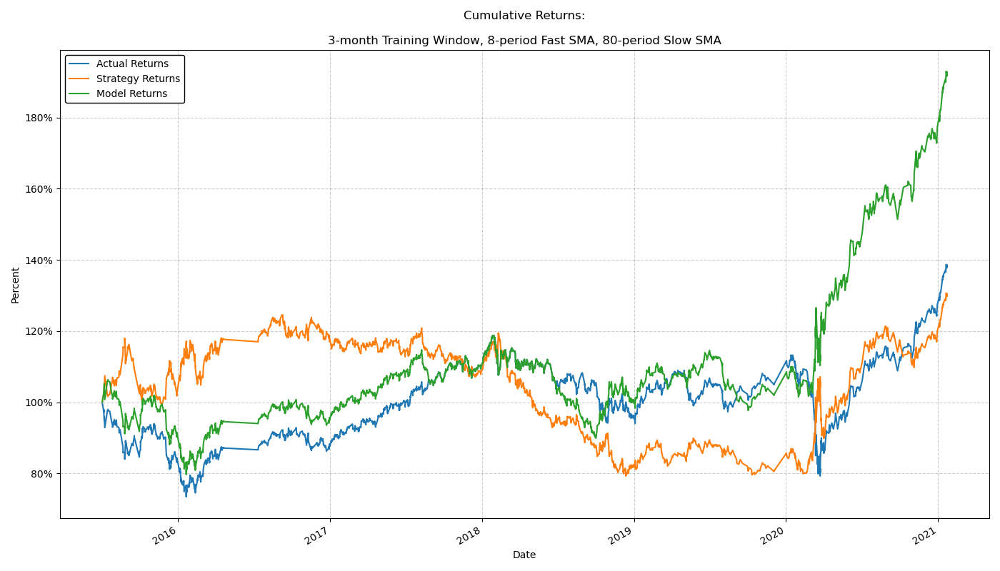
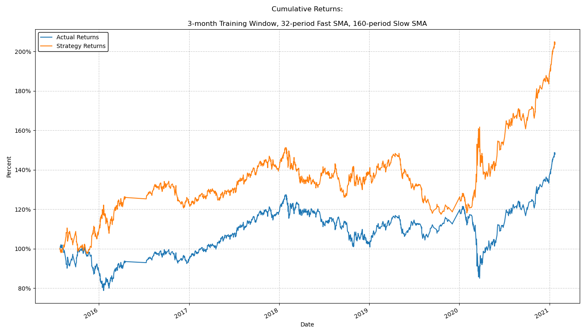
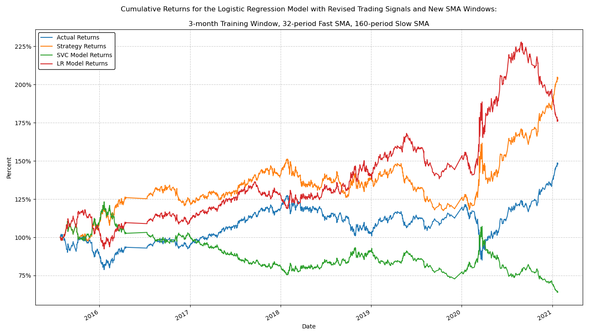

# Fintech Bootcamp - Algorithmic Trading Challenge

## Summary

This repository contains the files for the module 14 homework assignment: algorithmic trading challenge.

## File description

### Primary Code

All of the primary code can be found in the Jupyter notebook titled "machine_learning_trading_bot.ipynb", which is located in this folder.

### Data Files

All of the data files can be found in the Resources folder:

- emerging_markets_ohlcv.csv

### Plots

All of the plots can be found in the Plots folder:

- 01_baseline_trading_algorithm_returns.png
- 02_new_training_window.png
- 03_new_sma_windows.png
- 04_baseline_trading_algorithm_returns_revisited.png
- 05_new_training_window_revisited.png
- 06_new_sma_windows_revisited.png
- 07_improved_trading_strategy_no_model.png
- 07_improved_trading_strategy.png
- 08_logistic_regression_baseline_returns.png
- 09_baseline_trading_algorithm_revisited_logistic_regression.png
- 10_new_training_window_revisited_logistic_regression.png
- 11_improved_trading_strategy_logistic_regression.png
- 20_Trading_Strategy_Summary.png
- 21_Model_Retults_Summary.png

### Reports

All of the confusion matrices and classification reports can be found in the Reports folder:

- 01_baseline_trading_algorithm_confusion_matrix.png
- 01_baseline_trading_algorithm_classification_report.png
- 02_new_training_window_confusion_matrix.png
- 02_new_training_window_classification_report.png
- 03_new_sma_windows_confusion_matrix.png
- 03_new_sma_windows_classification_report.png
- 04_baseline_trading_algorithm_returns_revisited_confusion_matrix.png
- 04_baseline_trading_algorithm_returns_revisited_classification_report.png
- 05_new_training_window_revisited_confusion_matrix.png
- 05_new_training_window_revisited_classification_report.png
- 06_new_sma_windows_revisited_confusion_matrix.png
- 06_new_sma_windows_revisited_classification_report.png
- 07_improved_trading_strategy_confusion_matrix.png
- 07_improved_trading_strategy_classification_report.png
- 08_logistic_regression_baseline_confusion_matrix.png
- 08_logistic_regression_baseline_classification_report.png
- 09_baseline_trading_algorithm_revisited_logistic_regression_confusion_matrix.png
- 09_baseline_trading_algorithm_revisited_logistic_regression_classification_report.png
- 10_new_training_window_revisited_logistic_regression_confusion_matrix.png
- 10_new_training_window_revisited_logistic_regression_classification_report.png
- 11_improved_trading_strategy_logistic_regression_confusion_matrix.png
- 11_improved_trading_strategy_logistic_regression_classification_report.png

### Supplementary Images

All of the supplementary images used in the discussion and evaluation report can be found in the Images folder:

- 01_baseline_trading_algorithm_signals.png
- 02_baseline_trading_algorithm_strategy_returns.png
- 03_baseline_trading_algorithm_strategy_returns_2.png
- 04_baseline_trading_algorithm_model_returns.png
- 05_baseline_trading_algorithm_revisited_signals.png

# Evaluation Report

## A Quick Note on Algorithmic Trading Using Supervised Learning

The spirit of this challenge assignment encompasses two distinct tasks:

1) Create a good trading strategy (i.e., good trading signals) that outperforms the buy-and-hold approach.
2) Create a predictive model that's capable of forecasting the trading signals that implement the strategy.

The tasks are distinct because it's possible to do one of them without doing the other.  A good trading strategy will backtest better than buying and holding.  A good model will faithfully predict the signals that are use to implement the trading strategy.  If the trading strategy is good but the model is bad, then the signals to buy/sell are appropriate, but the model isn't predicting the signals very well.  If the trading strategy is bad but the model is good, then the signals to buy/sell aren't appropriate, but the model will predict the signals with a high degree of accuracy.  That distinction is important because the trading strategy and the predictive model have to be evaluated independently of each other.

### Evaluating the Trading Strategy

The efficacy of the trading strategy is determined by the financial performance of the `Strategy Returns` (depicted in most of the plots below with an orange line) relative to the `Actual Returns` (depicted in most of the plots below with a blue line).  The Actual Returns represent the buy-and-hold strategy of purchasing the exchange-traded fund (ETF) and selling the shares at a later date.  The Strategy Returns represent a combination of buying and selling short the ETF based on the trading signals we've created in the dataset.

Importantly, neither of those values evaulates the financial performance of the predictive model.  To evaluate that, I've created a third set of returns called `Model Returns` (depicted in most of the plots below with a green line).  The Model Returns represent the financial performance of the predictive model trying to implement the trading strategy.  The Model Returns are different from the Strategy Returns (orange line) because the model is imperfect: it contains false positives and negatives that affect whether the algorithm buys or sells, even when the trading strategy calls for the opposite.

### Evaluating the Model Performance

The performance of the predictive model is determined using confusion matrices and classification reports.

Although they weren't required by the exercise, confusion matrices are extremely helpful for understanding the performance of the model.  Consequently, they've been added to this analysis in addition to the classification reports and plots.  In this case, the possible outcomes in the confusion matrices are:

- True Negatives (TNs): Instances where the model correctly predicted that the trading Signal would be to sell
- False Positives (FPs): Instances where the model predicted that the trading signal would be to buy, but the actual signal was to sell
- False Negatives (FNs): Instances where the model predicted that the trading signal would be to sell, but the actual signal was to buy
- True Positives (TPs): Instances where the model correctly predicted that the trading signal would be to buy

In principle, the best possible result would be for there to only be true positives and true negatives, because that would indicate perfect accuracy by the model.  In practice, the false positives and negatives are important to understand and pay attention to, because they are instances of the model's shortcomings.  Specifically, false positives are times when the model predicted buy, but the trading strategy called for a sell, and false negatives are times when the model predicted sell, but the trading strategy called for a buy.  It is possible to make or lose money having either mistaken prediction, because making or losing money is only a function of where the ETF price goes during the time period where the mistake is made.

Classification reports effectively contain much of the same information as the confusion matrices, but that information is presented as model precision, recall, accuracy, and other related values.

### A Quick Note on the Starter Code for the Baseline Trading Algorithm

As originally provided in the starter code, the baseline trading algorithm is strange for two reasons:

1) The signals (to buy or sell) aren't generated using the simple moving averages (SMAs).
2) There aren't any model returns.  Instead, the starter code calculates strategy returns using the idealized (actual) trading signals rather than the signals predicted by the model.

Both of those things have significant consequences for the performance and evaluation of the model, and I've tried to address them in this report.  Please see below for more information.

#### Signals to Buy and Sell:

Normally, trading strategies that involve simple moving averages (SMAs) will use those averages to create the signals to buy or sell.  Instead, in this exercise, the starter code generates the signals using the price movement of the exchange-traded fund (ETF):

In short, if the ETF goes up in price, then the signal will be to buy.  If the ETF goes down in price, then the signal will be to sell.  As a result, the baseline trading algorithm is ultimately trying to predict whether the ETF price will go up or down in the next temporal period, which can be anywhere from 15 minutes to several days later.  This inconsistency in the data set and the way the signals are generated almost makes the modeling task like predicting noise in the market, which is both difficult to do and a weird way to build a trading algorithm.

For the sake of completing the exercise as intended, Cases 1-3 and 8 below use the trading signals that are provided by the starter code.  However, Cases 4-7 and 9-11 use different trading signals as a supplement to the challenge assignment.  The other trading signals are simple and intuitive, but they are different from the ones that were provided, and they are explained later in this report.

#### Strategy Returns and Model Returns:

As intended in the starter code, the strategy returns are calculated using the idealized (actual) signals rather than the predicted (forecasted) signals:

Instead of being a function of the predicted signal value, the strategy returns in the `signals_df` are equal to the actual returns multiplied by a shifted version of the actual signal value:

In principle, there's nothing wrong with that approach, as long as you realize that the strategy returns on each of these plots does not reflect the performance of the predictive model, because the model predictions are in the column `predictions_df['Predicted']`, not `signals_df['Strategy Returns']`.

A simple way of understanding the `'Strategy Returns'` is that they represent the financial performance of the model if it __had perfect accuracy__.  Of course, most models don't have perfect accuracy, so there needs to be another line on each of these plots that reflects the financial performance of the predictive model, which I've called `'Model Returns'`:

The Model Returns are calculated the same way as the Strategy Returns, except they use the predicted signals rather than the actual ones.  Consequently, the Strategy Returns demonstrate the efficacy of the signaling approach, whereas the Model Returns demonstrate the efficacy of the model itself, with all of its false positives and false negatives included.

## Case 1: The Baseline Trading Algorithm

To demonstrate all of the above points, consider the baseline trading algorithm as it was provided in the starter code.  The model itself doesn't perform particularly well:

From the confusion matrix and classification report, it's clear that the predictive model nearly always predicts a buy signal.  The model only generated 161 sell signals out of a total of 4092 opportunities (3.93%), even though there were 1804 instances (44.09%) of actual sell signals in the test data set.  Because the model nearly always suggests buying, one would expect that the model performance greatly resembles a buy-and-hold strategy:

The performance of the buy-and-hold strategy is given by the blue line on the plot (Actual Returns).  However, the Strategy Returns, as defined by the starter code, look nothing like the buy and hold approach.  That's because the trading signals for the Strategy Returns aren't being generated by the model - they're being generated by the data that's testing the model.  Obviously the Strategy Returns don't perform very well, but that's just because the approach for creating the signals isn't very good.  The Model Returns are actually given by the green line, which greatly resembles the buy-and-hold approach.

In summary, the blue line is the buy-and-hold value of the ETF over time.  The orange line is the cumulative value of the trading approach we're trying to implement.  The green line is the cumulative value of the trading outcomes predicted by the model.

It turns out that the trading strategy in the baseline trading algorithm greatly underperforms the buy-and-hold value of the ETF.  However, the model isn't very good at forcasting the signals that would implement that (bad) trading strategy, so the predictive model accidentially outperforms the market.  If the model were accurate, the green line would resemble the orange one, but instead the green line resembles the blue one because the model almost never predicts a sell signal.

## Case 2: Tuning Baseline Trading Algorithm By Changing the Training Window

Because the starter code's approach to generating the trading signals is essentially tracking noise in the market, the trading signals have a weak relationship with the size of the training window and the size of the SMAs.  For example, if you were to increase the size of the training window to 12 months from 3 months, you might expect better results, but instead this happens:

Now the model literally never predicts a sell signal.  The outcome of increasing the trading window is that the model results are identical to buying and holding:

In the above plot, you can't see the blue line because it's behind the green one.  Again, the Strategy Returns are showing something else entirely: they illustrate the cumulative financial performance of the approach we're trying to implement, albeit very unsuccessfully.

Although the training window has changed from the baseline algorithm, the approach for generating the trading signals hasn't changed, so the strategy returns still aren't very good.  But in this case, the model performance is identical to buying and holding because the predictive model never predicts a sell signal.

## Case 3: Tuning Baseline Trading Algorithm By Changing the SMA Windows

The baseline trading algorithm has a 4-period fast SMA and a 100-period slow SMA.  If you change the SMA windows to be 8-period and 80-period, respectively, then the results look like this:

Once again, the model almost never predicts a sell signal.  It sells more often than the previous model, but not by much, and it predicts a sell signal less often than the baseline trading algorithm.  As a result, you would expect to see financial performance similar to the buy-and-hold strategy:

And the results are similar!  In fact, you can see the exact point where the predicted trading signals diverge from the actual (test) trading signals.  The blue line is behind the green one for most of the plot, but they diverge roughly four-fifths of the way through.  The Strategy Returns still aren't very good, but the process for generating the actual trading signals hasn't changed from the baseline, so that's expected.

## Case 4: Changing the Trading Signals and Reevaluating the Baseline Trading Algorithm

*Note that Cases 4-7 aren't required by the challenge, but I found them instructive and helpful, so I'm leaving them in the report.

In an effort to improve the trading strategy and the predictive model, I adjusted the actual trading signals to be a function of the SMA window size:

This change is intuitive.  When the short SMA window is above the long SMA window, the signal should be to buy.  When the short SMA window is below the long SMA window, the signal should be to sell.

By making the above change and rerunning the baseline case (3-month training window, 4-period short SMA window, 100-period long SMA window), the performance of the trading algorithm improves:

Relative to the predictive model from the baseline trading algorithm, this is a significant improvement.  The accuracy of the model is up by 12% and the model is far better at predicting sell signals.  The financial performance looks like this:

The Strategy Returns are now a marginal improvement over the buy-and-hold approach, but they're a significant improvement over the Strategy Returns in the original baseline trading algorithm, which underperformed the buy-and-hold approach by nearly 70% (cumulatively, the Actual Returns saw a 40% increase, but the Strategy Returns in the baseline trading algorithm saw roughly a 30% decrease).

Interestingly, the Model Returns are significantly higher than both the Actual and Strategy Returns.  Ironically, this is partially due to bad model performance during 2017, where the model predicts a bunch of false positives (i.e., the model predicts buy, but the strategy suggests to sell) and buying-and-holding is the correct way to make money.  But it's also because the returns are significantly higher in late 2018 and throughout 2020, where the model appears to be both accurate and inaccurate at just the right times.

## Case 5: Tuning the New Trading Algorithm by Changing the Training Window

With the new signals in place, I'll try tuning the model using the same parameters as before.  Case 5 is analogous to Case 2, with a 12-month training window instead of a 3-month one.  The results are as follows:

Interestingly, this is a very good model.  Its accuracy is now 84%, which is a signifcant improvement over the 56% with no sell signals from Case 2.

Financially, the algorithm performance is lackluster, but that's because the trading strategy underperforms the buy-and-hold option and the Model Returns underperform the Strategy Returns.  Despite being the most accurate model, the trading strategy still needs to be improved.

## Case 6: Tuning the New Trading Algorithm by Changing the SMA Windows

Once again with the new signals, I'll try tuning the model using the same parameters as before.  Case 6 is analogous to Case 3, with an 8-period fast SMA and an 80-period slow SMA.  The results are as follows:

In the same way that the model in Case 4 was a significant improvement over the model in Case 1 (the baseline trading algorithm), the model in Case 6 is a significant improvement over the model in Case 3.  The model is now 69% accurate, which is a 13% improvement, and it predicts many more sell signals than the model in Case 3.  It's not as accurate as the model in Case 5, but Case 5 had a lot more training data.

Financially, the Model Returns are very good, although the Strategy Returns are lackluster.  This outcome is reminiscent of the result from Case 4, although this time the Strategy Returns marginally underperform the Actual Returns.  Like Case 4, the model appears to be accurate and inaccurate at just the right times.  In general, the Model Returns differ from the Strategy Returns in 2017 and late 2018, but the Model Returns greatly outperform the Strategy and Actual Returns in 2020.

## Case 7: Improving the Trading Strategy by Changing the SMA Windows

Although Cases 4 and 6 had good Model Returns, their success was somewhat coincidential.  The predictive model is trying to implement the trading strategy, so the Model Returns are supposed to resemble the Strategy Returns.  Using some trial and error, I discovered a trading strategy with the new signals that backtested very well:

In principle, this is a promising way to start developing an algorithmic trading model, because the Strategy Returns are much better than the Actual Returns.  The predictive model will be trained and tested against the trading signals that drive the performance of the Strategy Returns, so if the model is good, then the Model Returns should also be good.  After training and testing the model, the results were as follows:

Interestingly, it turns out that the model isn't very good, despite the trading strategy being better than before.  The accuracy is now 46%, which is even worse than the baseline trading algorithm that was trying to predict noise.  That poor accuracy is reflected in the model's financial performance:

This model is the spiritual opposite of the models from Cases 4 and 6.  Fairly consistently, whenever the Strategy Returns increase, the Model Returns decrease, indicating that this model is wrong at all the wrong times.  The trading strategy is still good, but the model needs improvement.

## Discussion

There are several key takeaways from the above cases:

First, improving the trading signals creates a better trading strategy.  That may seem intuitive, but the trading signals that were originally provided in the starter code gave rise to very bad strategy returns.  Improving the trading signals and backtesting the strategy is an important first step in creating a trading algorithm.

Second, for the cases that had better a better trading strategy (Cases 4-7), the better trading strategy didn't automatically lead to better financial results.  The model still has to be carefully tuned.  Cases 4 and 6 show that the model can accidentially make money.  Case 7 shows that the model can accidentially lose it.

Third, for some reason, the models in Cases 4-7 are much more tolerant of false positives than false negatives.  At a glance, that difference alone seems to drive the difference between whether a model accidentially makes or loses money.  The financially successful models have far more false positives than negatives, and it's the opposite for the unsuccessful models.  For now, I'm not entirely sure why that's the case, but I'm not sure it's a coincidence.

## Evaluating a New Machine Learning Classifier

The previous cases used support vector classification (SVC) to make the predictive model.  In the following cases, I chose to use a simple logistic regression model as the classifier instead.

## Case 8: The Baseline Trading Algorithm with a Logistic Regression Classifier

Case 8 is identical to the baseline trading algorithm (Case 1), except the classifier is a logistic regression model instead of an SVC model.  The results are as follows:

Unlike the baseline trading algorithm, this model predicts far more sell signals.  The baseline trading algorithm only predicted 3.93% (161/4092) sell signals, so it ultimately performed like a buy-and hold trading strategy.  This model, with the logistic regression classifiers, predicts 33.58% (1374/4092) sell signals, so the model is behaving very differently, even if its accuracy is marginally worse than the baseline trading algorithm.  Practically, the difference between the logisitic regression classifiers and the SVC classifiers is that the misclassifications are far more balanced using logisitic regression:
- Logisitic Regression:
    - Accuracy: 52%
    - Errors: 
        - 1201 FP
        - 771 FN
- SVC (Case 1):
    - Accuracy: 55%
    - Errors:
        - 1735 FP
        - 92 FN

That outcome is easy to see in the financial performance plot:

On the above plot, the SVC Model Returns (green line) are simply the Model Returns from the appropriate plot of comparison, which in this case is the baseline trading algorithm.  The LR Model Returns are the Model Returns using the logisitic regression classifiers instead of the SVCs.

Even though the accuracies of the logisitic regression model and the SVC model are quite close to each other, their financial performance is very different.  The baseline trading algorithm (SVC Model Returns) largely resembled a buy-and-hold approach, whereas the LR Model diverges from the buy-and-hold approach much more frequently.  Once again, the gains and losses are largely coincidental, because the SVC and LR Model Returns are trying (and failing) to replicate the Strategy Returns (orange line).  But from this exercise, it's easy to see how changing only the classification model can greatly affect the model's performance, even when the models are trained and tested on the same underlying data.

## Case 9: The Trading Algorithm with New Signals and a Logistic Regression Classifier

*Note that Cases 9-11 aren't required by the challenge, but I found them instructive and helpful, so I'm leaving them in the report.

Case 9 is the same as Case 4, except logistic regression classifiers are used instead of SVCs.  Case 4 was significant because it had the best Model Returns of any model that was built using SVCs, and it was only different from Case 1 (the baseline trading algorithm) in that it had the new trading signals rather than the ones provided in the starter code.  Consequently, Case 9 is just the baseline trading algorithm with new trading signals and new classifiers.  The results are as follows:

All things considered, this model is a significant improvement over the one from Case 4.  The logistic regression classifiers have greatly improved the accuracy of the model, and although the misclassifications are still lopsided in favor of false positives, they are less lopsided than they were before.  Whether those errors are good or bad will ultimately depend on how the model is being used, but increasing the model's accuracy by 20% simply by changing the classifiers is impressive.

- Logisitic Regression:
    - Accuracy: 87%
    - Errors: 
        - 429 FP
        - 101 FN
- SVC (Case 4):
    - Accuracy: 67%
    - Errors:
        - 1363 FP
        - 7 FN

The financial performance is as follows:

Once again, the green line shows the financial performance of the model with SVC classifiers and the red line shows the financial performance of the one with logisitic regression classifiers.  The SVC Model performance in Case 4 was extremely good, but that model was wrong in all the right ways.  The LR Model is significantly more accurate, and it's also wrong in a lot of the right ways.  Both models offer superior financial performance to the Strategy Returns, but the LR Model Returns are surprising given that 87% of the time, the LR Model and the Strategy are in agreement with each other.

## Case 10: The Trading Algorithm with New Signals, a New Training Window, and a Logistic Regression Classifier

Case 10 is the same as Case 5, except logisitic regression classifiers are used instead of SVCs.  Case 5 was significant because it was the best performing model built using SVCs, and it not only had new trading signals, but it also had a new training window.  Consequently, relative to the baseline trading algorithm, Case 10 uses a trading algorithm with new signals, a new training window, and a logistic regression classifier.  The results are as follows:

All things considered, this is an impressively accurate model, even relative to the one in Case 5.  As with the previous case, the logistic regression classifier has greatly improved the accuracy of the model, although it's greatly shifted the relative balance of the errors.  The SVC model only had 84% accuracy, but it was roughly 4-to-1 FPs to FNs.  The LR model has 97% accuracy, but it's roughly 1-to-5 FPs to FNs.

- Logisitic Regression:
    - Accuracy: 97%
    - Errors: 
        - 17 FP
        - 102 FN
- SVC (Case 5):
    - Accuracy: 84%
    - Errors:
        - 447 FP
        - 88 FN

The financial performance is as follows:

Even though the LR Model Returns are 97% consistent with the Strategy Returns, it's still enough to create a 25% difference in the cumulative value of the returns between those two groups.  Like many of the other Cases, the relatively-high number of FNs may have hurt the financial performance of the model returns relative to the strategy.  And even though the Strategy Returns,  SVC Model Returns, and LR Model Returns all underperformed the Actual (buy-and-hold) Returns, that's still not a problem with the model - it's a problem with the trading strategy. 

## Case 11: Improved Trading Strategy With a Model Built Using a Logistic Regression Classifier

Finally, Case 11 is the same as Case 7, except logistic regression classifiers are used instead of SVCs.  Case 7 was significant because it had the best trading strategy of all the groups (i.e., its Strategy Returns were the highest).  In principle, a high accuracy score should yield good returns.  Relative to the baseline trading algorithm, Cast 11 uses a trading algorithm with new signals, new SMA windows, and a logisitic regression classifier.  The results are as follows:

Unfortunately, the model is significantly less accurate than the one in Case 10, although it's still much more accurate than the one in Case 7.  Additionally, this model restored the balance of errors between FPs and FNs, which was extremely lopsided in favor of FNs in Case 7.  For having a good trading strategy, Case 7 had surprisingly bad Model Returns, but despite its inaccuracy, the logisitic regression classifiers may have fixed some of its financial performance.

- Logisitic Regression:
    - Accuracy: 66%
    - Errors: 
        - 712 FP
        - 650 FN
- SVC (Case 7):
    - Accuracy: 46%
    - Errors:
        - 5 FP
        - 2174 FN

The financial returns are as follows:

The LR Model Returns are extremely interesting, especially relative to the SVC Model Returns.  The LR Model provided much better financial performance, but it's very clear where the LR Model is different from the Strategy Returns.  Nevertheless, the LR Model outperformed the Actual Returns by quite a bit, which is promising given the good Strategy Returns.  Additional improvements to the model would build more faith that those returns could be consistent.

## Discussion

As with Cases 1-7, there a few key takeaways from Cases 8-11:

First, the LR classifiers improved the accuracy of every single model with the new trading signals (Cases 9-11), usually by quite a bit.  Switching to the new signals created an opportunity for LR classifiers to really shine, and by extension, the choice of classifier matters a lot to the performance of the model.

Second, a high degree of accuracy doesn't necessarily guarantee cumulative results consistent with the testing dataset.  The long-term impact of errors on cumulative performance depends on the direction and impact of each error.

Third, the financial performance of both the LR and SVC models shows how volatile their cumulative peformance can be.  It's hard to pin down why certain models do well and others don't, and even if the financial performance is ahead or behind of the market or trading strategy, it's not always easy to know if you should switch your strategy part way through.  In a perfect world, the model returns would equal the strategy returns, but as can be seen from Case 10 specifically, even 97% accuracy can lead to a 25% difference in value at 5 years.

## Summary

Although the following plots have a lot of lines, they are summaries of each of the strategies and models tested above.

### Strategy Returns

The following is a plot of the cumulative financial returns of the various trading strategies used to train and test the predictive models.  For reference, the Actual Returns are also included.  Although it may seem like some lines are missing, every line with an LR counterpart has the same Strategy Returns plotted twice.  For example, "Baseline Returns" has the same Strategy Returns as "Baseline Returns LR", because the difference between those lines is the classifier in the predictive model, not how the trading signals are generated.  Additionally, the "New SMA Windows" line had very similar Strategy returns to the Baseline Returns.

As can be seen in he plot, the trading strategy that backtested the best was the "Improved Trading Strategy", whose line was duplicated by "Improved Trading Strategy LR" (Cases 7 and 11, respectively).

### Model Returns

The following is a plot of the cumulative financial returns of the various models over time.  For reference, the Actual Returns are also included.

As can be seen in the plot, the model that backtested the best was the "Baseline Returns Revisited Model", which was the baseline trading algorithm with new signals (Case 4).  Given the relatively low accuracy of the model, that success was pretty lucky, but nevertheless, it remains the model that generated the highest return.

